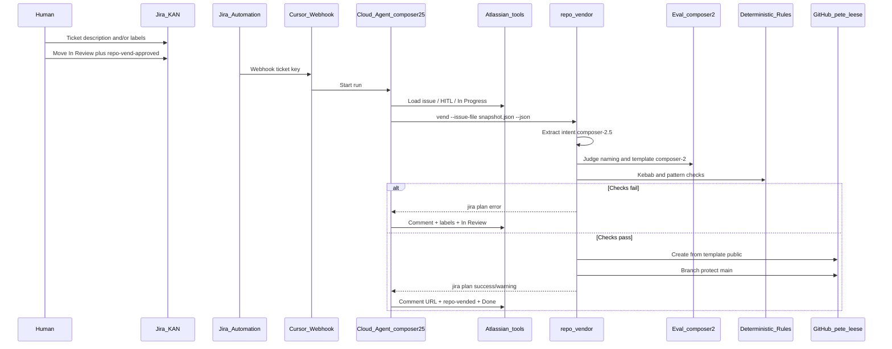

# Agentic Repo Vending

Laptop-free workflow that vends public GitHub repositories from Jira tickets using **Cursor Cloud Agents**, **PydanticAI**, and dual-model evals.

**Owner:** [`pete-leese`](https://github.com/pete-leese)  
**Jira board:** [KAN](https://agentic-workflow-demo.atlassian.net/jira/software/projects/KAN/boards/2)

## What it does

1. Human moves a ticket to **In Review** and adds label **`repo-vend-approved`**
2. Jira Automation POSTs a webhook to a Cursor Automation
3. Cloud Agent uses **Atlassian tools** to load the issue, then runs `python -m repo_vendor vend --issue-file … --json`
4. Orchestrator model **`composer-2.5`** extracts intent (free text and/or labels)
5. Eval model **`composer-2`** judges naming + template choice
6. Deterministic kebab/pattern rules must also pass (hard gate)
7. On success: create public repo from `template-terraform-repo` or `template-python-repo`, protect `main`; Automation applies the JSON Jira plan (comment URL, **`repo-vended`** + **`repo-vend-success`** or **`repo-vend-warning`**, **Done**)
8. On failure: Automation applies error plan (comment, **`repo-vend-error`**, **In Review**) — no repo created
9. Rename: comment a new name on a vended ticket → re-eval → rename

Setup: [docs/jira-setup.md](docs/jira-setup.md) · Automation prompt: [docs/automation-setup.md](docs/automation-setup.md)

## Architecture



## Models (explicit)

| Role | Model ID |
|------|----------|
| Cloud Automation runtime | `composer-2.5` |
| Orchestrator (intent) | `composer-2.5` |
| Eval judge | `composer-2` |
| Naming / template gate | deterministic (no LLM) |

## Quick links

- [Getting started](docs/getting-started.md)
- [Jira + webhook setup](docs/jira-setup.md)
- [Demo walkthrough](docs/demo-walkthrough.md)
- [Automation setup](docs/automation-setup.md)
- [Post-MVP (OTEL / harnesses)](docs/post-mvp.md)
- [Domain glossary](CONTEXT.md)
- [ADRs](docs/adr/)

## Triggering

**Jira Automation → Cursor webhook** is the primary wake path.  
**Atlassian tools** handle all board I/O once the agent is running (not a wake trigger).  
See [docs/jira-setup.md](docs/jira-setup.md).

## Local development

```bash
pip install -e '.[dev,cursor]'
pytest
python -m repo_vendor doctor
echo '{"key":"KAN-1","summary":"python logging helper","description":"...","status":"In Review","labels":["repo-vend-approved","type-python"]}' \
  | python -m repo_vendor vend --json --dry-run
```

## Publish template repos

```bash
export GITHUB_TOKEN=...   # classic PAT with repo scope
chmod +x scripts/publish_templates.sh
./scripts/publish_templates.sh
```

## Secrets (Cloud Agent dashboard — never commit)

- `CURSOR_API_KEY` — generate a **new** key (rotate any key that was pasted into chat)
- `GITHUB_TOKEN` — classic `repo` recommended for create-from-template
- Jira board access: **Atlassian Automation tool** (no `JIRA_*` API tokens in the CLI)
