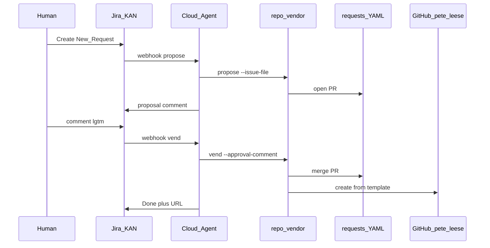

# Agentic Repo Vending

Laptop-free workflow that vends public GitHub repositories from Jira tickets using **Cursor Cloud Agents**, dual-model evals, and hybrid Spec Requests.

**Owner:** [`pete-leese`](https://github.com/pete-leese)  
**Jira board:** [KAN](https://agentic-workflow-demo.atlassian.net/jira/software/projects/KAN/boards/2)

## What it does

1. Human creates a ticket in **New Request**
2. Jira Automation POSTs `action: propose` → agent runs evals → comments proposal + opens `requests/<KEY>.yaml` PR
3. Human replies **`lgtm`** / **`approved`** / … (Keyword Approval)
4. Jira POSTs `action: vend` → agent merges Spec PR → create-from-template → protect `main`
5. No post-create rename

Setup: [Getting started](docs/getting-started.md) · [Jira + webhook](docs/jira-setup.md) · [Cursor Automation](docs/automation-setup.md) · [Rules](rules/naming.md) · [Config](repo-vend.yaml)

## Quick setup (Jira ↔ Cursor)

1. Create a Cursor **Webhook** Automation ([automation-setup.md](docs/automation-setup.md)); copy webhook URL + **webhook API key**.
2. Generate importable Jira rules (skill **generate-jira-automation**, or script):

```bash
python3 scripts/generate_jira_automation_import.py \
  --webhook-url 'https://api2.cursor.sh/automations/webhook/<YOUR_ID>'
```

3. Import `docs/jira/automation-rules-import.json` via **Space Settings → Automation → Global automation**  
   (or `{jira.base_url}/jira/settings/automation` from [`repo-vend.yaml`](repo-vend.yaml)).
4. On **each** rule’s **Send web request** POST, set `Authorization: Bearer <webhook_api_key>`.
5. Enable both rules; disable any old one-shot vend rule.

Full walkthrough: [docs/getting-started.md](docs/getting-started.md).

## Architecture



## Models

| Role | Model ID |
|------|----------|
| Cloud Automation / orchestrator | `composer-2.5` |
| Eval judge | `composer-2` |
| Naming gate | deterministic |

## Quick links

- [Getting started](docs/getting-started.md) (includes generate + import Jira rules)
- [Customizing (config, templates, rules)](docs/customizing.md)
- [Naming / HITL rules](rules/naming.md)
- [Project config](repo-vend.yaml)
- [Eval prompts (JSON)](evals/)
- [Spec requests](requests/)
- [Jira + webhook setup](docs/jira-setup.md)
- [Generate Jira Automation skill](.agents/skills/generate-jira-automation/SKILL.md)
- [Automation setup](docs/automation-setup.md)
- [Demo walkthrough](docs/demo-walkthrough.md)
- [Post-MVP](docs/post-mvp.md)
- [Domain glossary](CONTEXT.md)
- [ADRs](docs/adr/)

## Local development

```bash
pip install -e '.[dev,cursor]'
pytest
python -m repo_vendor doctor
echo '{"key":"KAN-1","summary":"python logging helper","description":"...","status":"New Request","labels":["type-python"]}' \
  | python -m repo_vendor propose --json --dry-run
```

## Secrets (Cloud Agent — never commit)

- `CURSOR_API_KEY`
- `GITHUB_TOKEN` — classic `repo` (Spec PRs + template generate)
- Jira: **Atlassian Automation tool**
