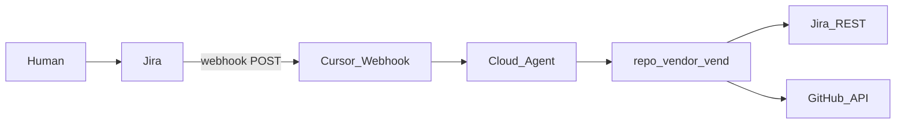

# Connecting your Jira to repo vending

**Primary path:** Jira Automation → HTTP webhook → Cursor Automation → `repo_vendor vend`.

**Atlassian MCP is not a trigger** — it only helps once an agent is already running.



## Path comparison

| Path | When to use |
|------|-------------|
| **Webhook (default)** | Working setup for this demo — near real-time |
| **Cursor in Jira** (`@Cursor`) | Cursor Teams/Enterprise + [Marketplace app](https://cursor.com/docs/integrations/jira) |
| **MCP** | Optional tooling inside a running agent — does not wake Cursor |

---

## Shared prerequisites

1. Cloud Agent secrets: `CURSOR_API_KEY`, `GITHUB_TOKEN`, `JIRA_EMAIL`, `JIRA_API_TOKEN`
2. Optional: `JIRA_BASE_URL`, `JIRA_IN_REVIEW_STATUS`, label name overrides
3. Labels:
   - `repo-vend-approved` (HITL)
   - `repo-vended` (set after create)
   - `repo-vend-success` | `repo-vend-warning` | `repo-vend-error` (outcome)
4. Template repos published

Board statuses used by the agent (override via env if your names differ):

| Phase | Default status |
|-------|----------------|
| HITL gate | In Review |
| While vending | In Progress |
| Success / warning | Done |
| Error (retry) | In Review |

---

## Webhook setup (default)

### 1. Cursor Automation

- Trigger: **Webhook**
- Repo: your `agentic-repo-vending` @ `main`
- Model: `composer-2.5`
- Instructions: parse `issue.key`, run `python -m repo_vendor vend --issue <KEY>`
- Save → copy **webhook URL** and the **webhook API key** for *this* automation  
  (not the global Cloud Agent `CURSOR_API_KEY` — that yields `missing required scope: automation:…`)

### 2. Jira Automation

1. Trigger: Issue transitioned **to** In Review  
2. Condition: Labels contains `repo-vend-approved`  
3. Action: **Send web request**
   - Method: `POST`
   - URL: Cursor webhook URL
   - Headers:

| Key | Value |
|-----|--------|
| `Authorization` | `Bearer <webhook_api_key_from_this_automation>` |
| `Content-Type` | `application/json` |

   - Body (custom JSON):

```json
{
  "action": "vend",
  "issue": { "key": "{{issue.key}}" }
}
```

4. Enable the rule and confirm Audit log → HTTP 2xx

If your site has no Automation **secrets**, paste the Bearer token in the header and limit who can edit automation rules.

### 3. Human workflow

1. Create ticket (free text and/or labels)  
2. Move to **In Review**  
3. Add **`repo-vend-approved`**  
4. Agent comments with repo URL (or what’s missing) and adds **`repo-vended`** on success  

---

## Configuring for *your* Jira site

| Variable | Example |
|----------|---------|
| `JIRA_BASE_URL` | `https://YOUR.atlassian.net` |
| `JIRA_IN_REVIEW_STATUS` | Exact status name on your board |
| `JIRA_APPROVED_LABEL` | `repo-vend-approved` |
| `JIRA_VENDED_LABEL` | `repo-vended` |
| `JIRA_EMAIL` / `JIRA_API_TOKEN` | User + [API token](https://id.atlassian.com/manage-profile/security/api-tokens) |

---

## Optional: Cursor in Jira (Teams / Enterprise)

Install Cursor from the Atlassian Marketplace, assign `@Cursor` (or automate assign). See [Cursor Jira docs](https://cursor.com/docs/integrations/jira). Personal plans typically use the webhook path above.
