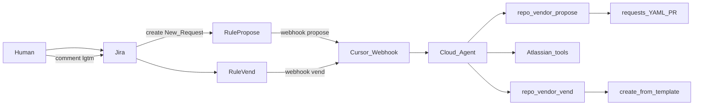

# Connecting your Jira to repo vending

**Primary path:** two Jira Automation rules → Cursor webhook → **Atlassian tools** for board I/O → `repo_vendor propose` / `vend`.

**Atlassian MCP/tools are not a wake trigger** — they are how the running Automation reads/writes the KAN board. The CLI never calls Jira REST.



## Shared prerequisites

1. Cloud Agent secrets: `CURSOR_API_KEY`, `GITHUB_TOKEN` (classic `repo` recommended; must open/merge PRs on the control-plane repo)
2. Labels: `repo-vend-proposed`, `repo-vended`, `repo-vend-success` | `repo-vend-warning` | `repo-vend-error`
3. Template repos published
4. **Atlassian** tool enabled on the Cursor Automation
5. Canonical rules: [`rules/naming.md`](../rules/naming.md)

Board statuses:

| Phase | Status |
|-------|--------|
| Create / propose | **New Request** |
| While creating repo | **In Progress** |
| Success / warning | **Done** |

## Rule 1 — Propose (issue created)

1. Trigger: **Issue created** (project KAN); condition status = **New Request** if available
2. Action: **Send web request** POST to Cursor webhook

Headers:

| Key | Value |
|-----|--------|
| `Authorization` | `Bearer <webhook_api_key>` |
| `Content-Type` | `application/json` |

Body:

```json
{
  "action": "propose",
  "issue": { "key": "{{issue.key}}" }
}
```

## Rule 2 — Vend (Keyword Approval)

1. Trigger: **Issue commented**
2. Conditions:
   - Comment body matches: `(?i)(?:\b(?:approved|lgtm|looks good|ship it)\b|(?<!\w)\+1(?!\w))`
   - Labels does **not** contain `repo-vended` (if condition available)
3. Action: POST same webhook

```json
{
  "action": "vend",
  "issue": { "key": "{{issue.key}}" },
  "comment": { "body": "{{comment.body}}" }
}
```

Keyword list: `approved`, `lgtm`, `looks good`, `ship it`, `+1`.  
Comment **likes/reactions are not supported** as triggers.

## Human workflow

1. Create ticket in **New Request** (free text and/or helper labels)
2. Agent comments with proposal (name, template, eval pass/fail) + Spec PR link
3. Reply `lgtm` (or another approval keyword)
4. Agent merges Spec PR, creates public GitHub repo, comments URL

Wrong name: edit description/labels and re-trigger propose **before** approving. No post-create rename.

## Importable Automation rules (JSON)

**Generate a fresh file** (recommended): run the project skill **generate-jira-automation**, or:

```bash
python3 scripts/generate_jira_automation_import.py --webhook-url 'https://api2.cursor.sh/automations/webhook/<YOUR_ID>'
```

That writes `docs/jira/automation-rules-import.json` using your webhook URL and settings from `repo-vend.yaml`.

Static starter (may need webhook URL edit): [`docs/jira/automation-rules-two-phase.json`](jira/automation-rules-two-phase.json)

1. Open **Space Settings → Automation → Global automation**, or `{jira.base_url}/jira/settings/automation` from `repo-vend.yaml`
2. **⋯ → Import rules**, upload the generated JSON  
3. For **each** rule’s **Send web request** POST action, set `Authorization: Bearer <Cursor_webhook_API_key>` (replace the placeholder)  
4. Disable/delete the old one-shot vend rule; **Enable** the two new rules  

Note: `idUuid` / component `id` values must be valid 36-char UUIDs. Label exclusion uses **`CONTAINS_NONE`**. See `.cursor/rules/jira-automation-export.mdc`.

Example rule export shape (sanitized):

```json
{
  "cloud": true,
  "rules": [
    {
      "name": "repo-vend-propose",
      "state": "ENABLED",
      "trigger": { "type": "jira.issue.event.trigger:created" },
      "components": [
        {
          "type": "jira.issue.outgoing.webhook",
          "value": {
            "url": "https://api2.cursor.sh/automations/webhook/<id>",
            "method": "POST",
            "customBody": "{ \"action\": \"propose\", \"issue\": { \"key\": \"{{issue.key}}\" } }"
          }
        }
      ]
    },
    {
      "name": "repo-vend-approve",
      "state": "ENABLED",
      "trigger": { "type": "jira.issue.event.trigger:commented" },
      "components": [
        {
          "type": "jira.issue.outgoing.webhook",
          "value": {
            "url": "https://api2.cursor.sh/automations/webhook/<id>",
            "method": "POST",
            "customBody": "{ \"action\": \"vend\", \"issue\": { \"key\": \"{{issue.key}}\" }, \"comment\": { \"body\": \"{{comment.body}}\" } }"
          }
        }
      ]
    }
  ]
}
```

Wire the comment-match condition in the Jira UI (Advanced compare / regex on `{{comment.body}}`).

## Optional env overrides

| Variable | Default |
|----------|---------|
| `JIRA_NEW_REQUEST_STATUS` | `New Request` |
| `JIRA_PROCESSING_STATUS` | `In Progress` |
| `JIRA_DONE_STATUS` | `Done` |
| `JIRA_PROPOSED_LABEL` | `repo-vend-proposed` |
| `CONTROL_PLANE_REPO` | `agentic-repo-vending` |
