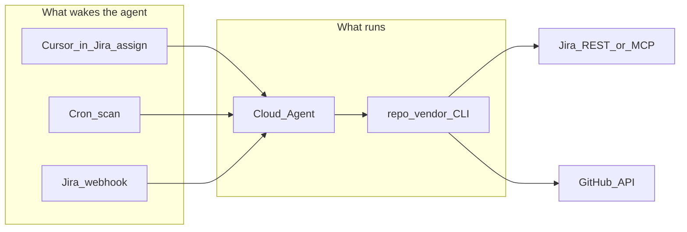

# Connecting your Jira to repo vending

Something has to **wake** a Cursor Cloud Agent when a ticket is ready.  
**Atlassian MCP does not do that** — MCP lets an already-running agent read/write Jira; it is not an event bus.

Pick the lightest path that fits your Cursor plan.



## Path comparison

| Path | Jira setup | Cursor setup | Latency | Best when |
|------|------------|--------------|---------|-----------|
| **A. Cursor in Jira** | Install Marketplace app; assign `@Cursor` (or a tiny “assign to Cursor” rule) | Teams/Enterprise + [Jira integration](https://cursor.com/docs/integrations/jira) | Fast | You have Cursor Teams/Enterprise |
| **B. Cron scan (recommended default)** | **None** beyond labels + HITL on the board | One Automation: schedule → `python -m repo_vendor scan` | Up to poll interval (e.g. 5 min) | Personal / Ultra; lowest config |
| **C. Webhook** | One Jira Automation “Send web request” | One Automation: webhook → `vend --issue` | Near real-time | You already have the webhook URL and want instant runs |

**MCP (Atlassian plugin)** is optional on all paths: useful inside the Cloud Agent for richer Jira tooling, but **not required** — this repo already talks to Jira via REST (`JIRA_EMAIL` + `JIRA_API_TOKEN`).

---

## Shared prerequisites (every path)

1. Cloud Agent secrets for `pete-leese/agentic-repo-vending` (or your fork):
   - `CURSOR_API_KEY`, `GITHUB_TOKEN`, `JIRA_EMAIL`, `JIRA_API_TOKEN`
2. Optional env: `JIRA_BASE_URL`, `JIRA_PROJECT_KEY` (default `KAN`), status/label names
3. Board labels:
   - `repo-vend-approved` — human gate (with status **In Review**)
   - `repo-vended` — written by the tool after success
4. Template repos published (`template-terraform-repo`, `template-python-repo`)

---

## Path B — Cron scan (lowest barrier)

No Jira Automation. No webhook URL.

### Cursor Automation

| Field | Value |
|--------|--------|
| Name | Repo Vend scan |
| Trigger | Schedule — e.g. every 5 minutes (`*/5 * * * *`) |
| Repo | your `agentic-repo-vending` fork @ `main` |
| Model | `composer-2.5` |
| Instructions | Run `python -m repo_vendor scan` and paste the output. Never print secrets. |

### Human workflow

1. Create ticket (free text and/or labels)
2. Move to **In Review**
3. Add **`repo-vend-approved`**
4. Within one poll interval, scan picks it up and vends (or comments what’s missing)

### Local / debug

```bash
python -m repo_vendor scan
python -m repo_vendor scan --dry-run
```

---

## Path C — Webhook (fast, more Jira clicks)

### Cursor Automation

Webhook trigger → instructions that parse `issue.key` and run:

`python -m repo_vendor vend --issue <KEY>`

Save → copy webhook URL + auth.

### Jira Automation (minimal)

1. Project → **Automation** → Create rule  
2. **Trigger:** Issue transitioned **to** In Review  
3. **Condition:** Labels contains `repo-vend-approved`  
4. **Action:** Send web request  
   - Method: `POST`  
   - URL: Cursor webhook URL  
   - Headers: Cursor’s Bearer / secret if required  
   - Body:

```json
{
  "action": "vend",
  "issue": { "key": "{{issue.key}}" }
}
```

5. Enable the rule

Verify: Automation **Audit log** shows 2xx; Cursor Automations **Runs** shows a start.

---

## Path A — Cursor in Jira (Teams / Enterprise)

If your plan supports it ([docs](https://cursor.com/docs/integrations/jira)):

1. Install **Cursor** from the Atlassian Marketplace  
2. Connect the GitHub repo in the Cursor Jira admin settings  
3. On an approved ticket, **assign to `@Cursor`** or mention `@Cursor` with instructions to run the vend flow  
4. Optional: Jira rule that assigns to `@Cursor` when status=In Review and label=`repo-vend-approved` — **no webhook**

Personal / Ultra accounts often cannot use this integration yet; use Path B or C.

---

## Configuring for *your* Jira site

Copy `.env.example` and set:

| Variable | Example |
|----------|---------|
| `JIRA_BASE_URL` | `https://YOUR.atlassian.net` |
| `JIRA_PROJECT_KEY` | `ENG` |
| `JIRA_IN_REVIEW_STATUS` | Exact status name on your board |
| `JIRA_APPROVED_LABEL` | `repo-vend-approved` (or your name) |
| `JIRA_VENDED_LABEL` | `repo-vended` |
| `JIRA_EMAIL` / `JIRA_API_TOKEN` | User + [API token](https://id.atlassian.com/manage-profile/security/api-tokens) |

Same values as Cloud Agent secrets. Status name must match the board **exactly** (case-sensitive in JQL).

---

## What we recommend

1. Start with **Path B (cron scan)** — one Cursor Automation, zero Jira Automation  
2. Add **Path C** only if you need near-instant vend  
3. Prefer **Path A** when Cursor Teams + Marketplace app are available  
4. Treat **MCP** as an enhancement for agents that already have a trigger, not as the trigger itself
